# Modify Commit
In this readme, shows how to modify latest commit message and specific commit message

## Modify latest commit
Please follow these steps to modify the commit message

1. check the git commits by typing `git log`

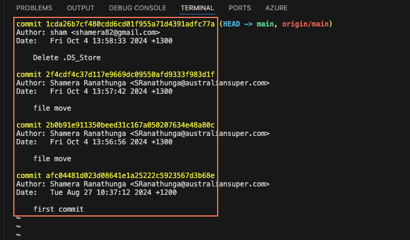

2. if you need to change the 1st commit use following steps
   - use command `git commit --amend`

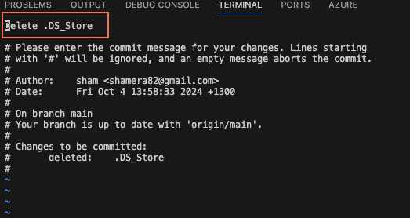

   - now you can edit the commit message in your default editor

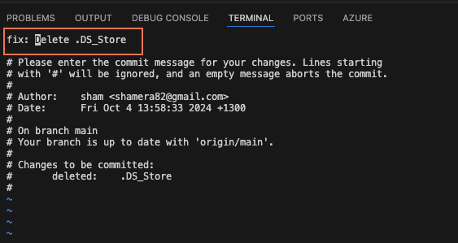

   - save and exit. you can see the following git commit amend output

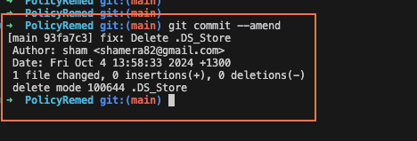

   - now if you look for `git log` you can see latest commit is updated with the changes.

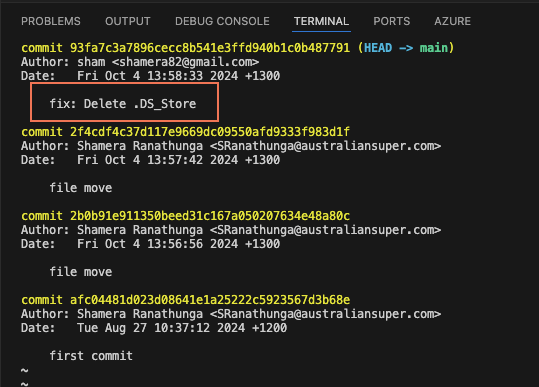

   - finally push the modified commit to your remote branch. you may need to use `git push --force` to achieve this.

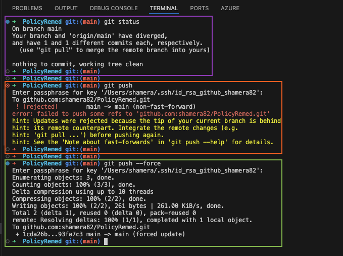

## Modify a specific commit
Please follow these steps to modify the commit message

1. check the git commits by typing `git log`

2. assume need to change the 3rd commit from top (2b0b91911350beed31c167a05020763448a80c). in this case you need to use git rebase. as follows 

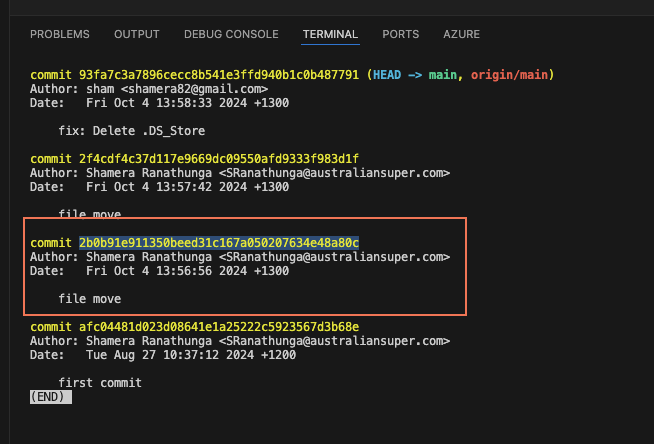

3. use command `git rebase --interactive 2b0b91e911350beed31c167a050207634e48a80c^` make sure to use `^`, it's very important. if not shows upto the commit `2b0b91e911350beed31c167a050207634e48a80c`

if you do it without `^` at the end of the commit id, you will get following output, which we can't see commit `2b0b91e911350beed31c167a050207634e48a80c`

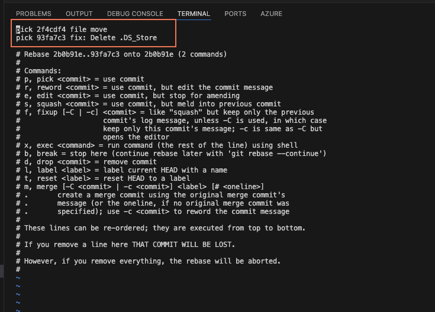

make sure to use `^` at the end of commit id, then u can see the rebase message with commit id `2b0b91e911350beed31c167a050207634e48a80c` in shortform as `Pick 2b0b91e file move`

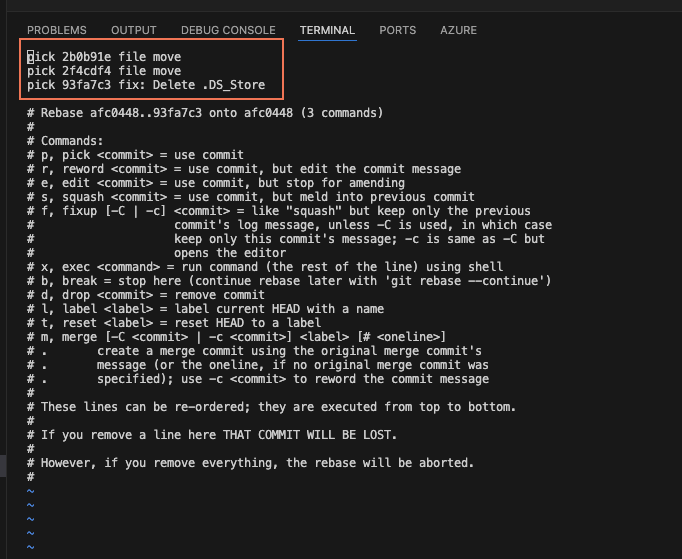

3. now you able to see commit id `2b0b91e911350beed31c167a050207634e48a80c` in shortform as `2b0b91e` in 1st line. you need to change `Pick` to `edit`, then save and exit.

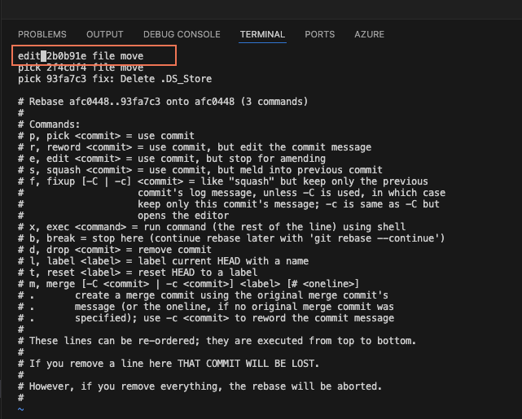

4. you can see this output, now type `git commit -amend`, 

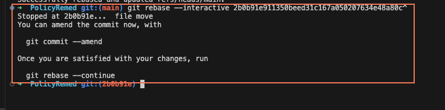

5. then edit the commit message, save and exit.

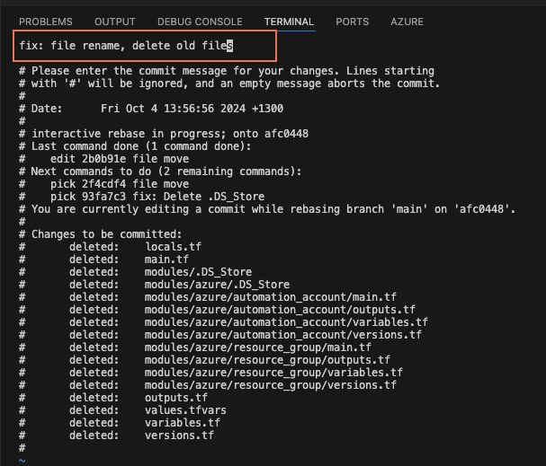

6. you can see output simillar to following output.

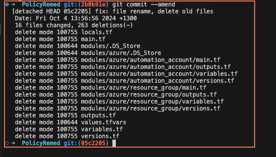

7. finaly to apply the commit message to your branch type `git rebase -continue`

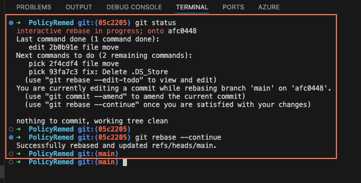

9. now if you check output of git log, you can see 3rd commit message has been change. you may can notice the commit id's from that commit to latest also change and can't see old commit id anymore. 

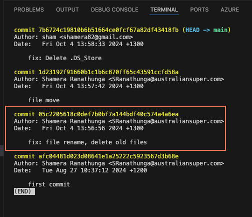

10. now you can force push the changes to remote branch

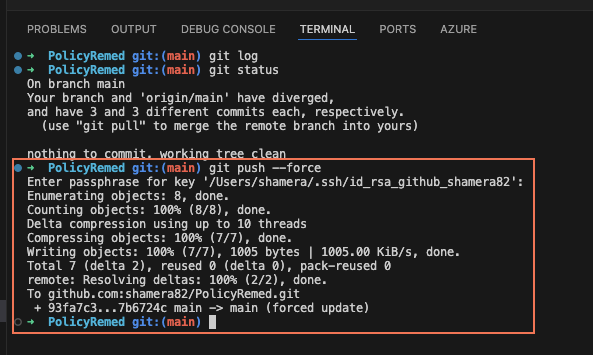

